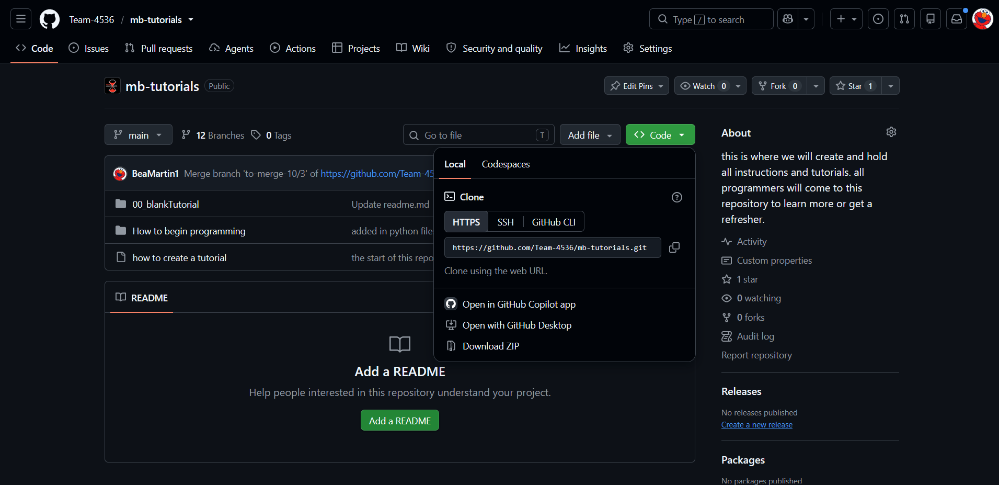
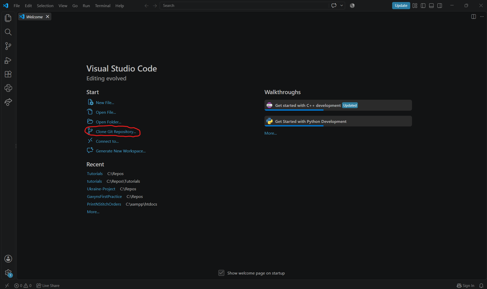
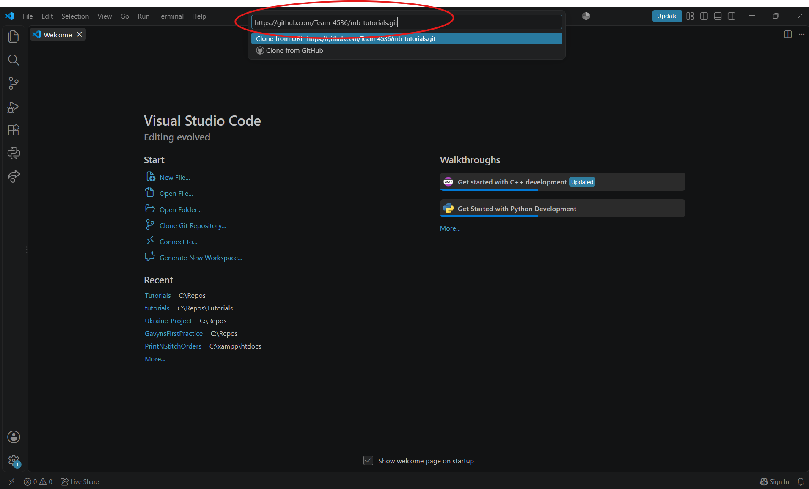
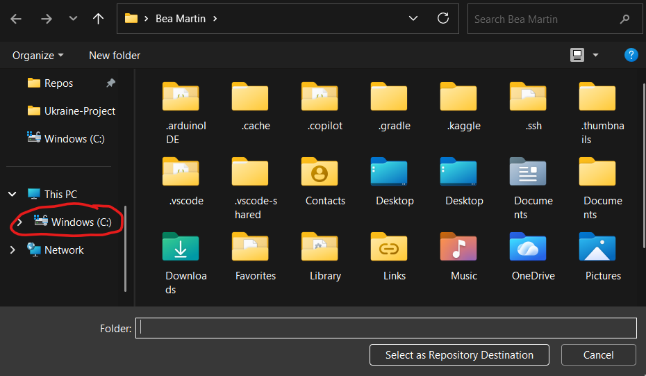
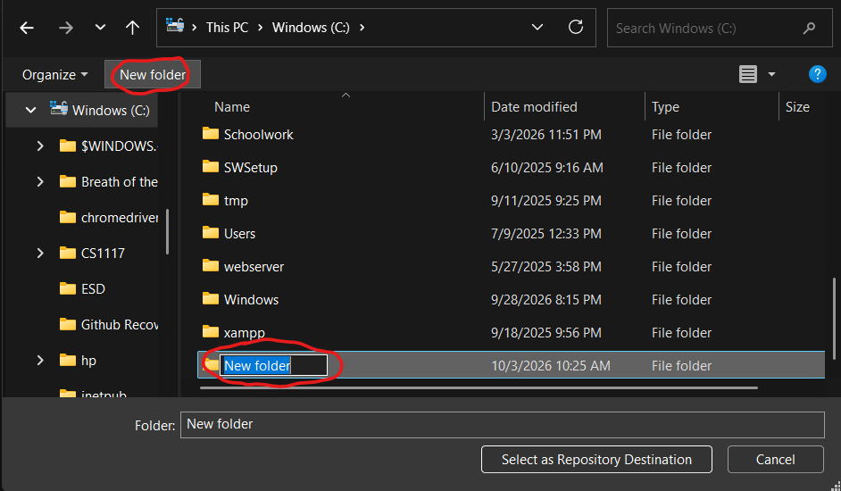
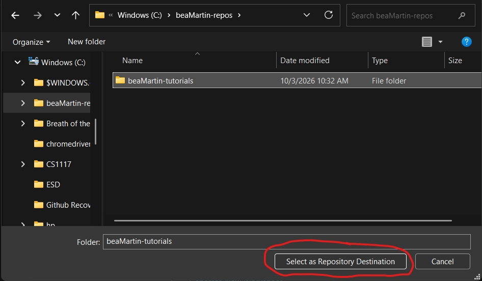
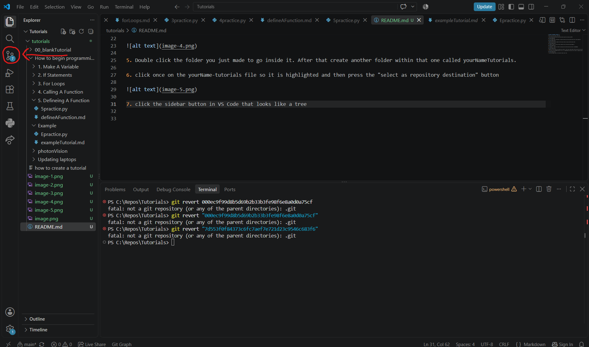
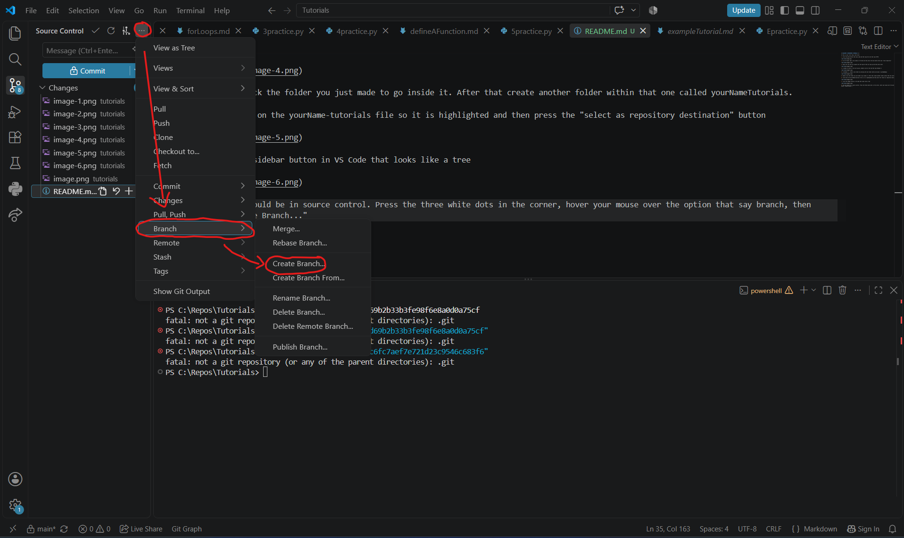
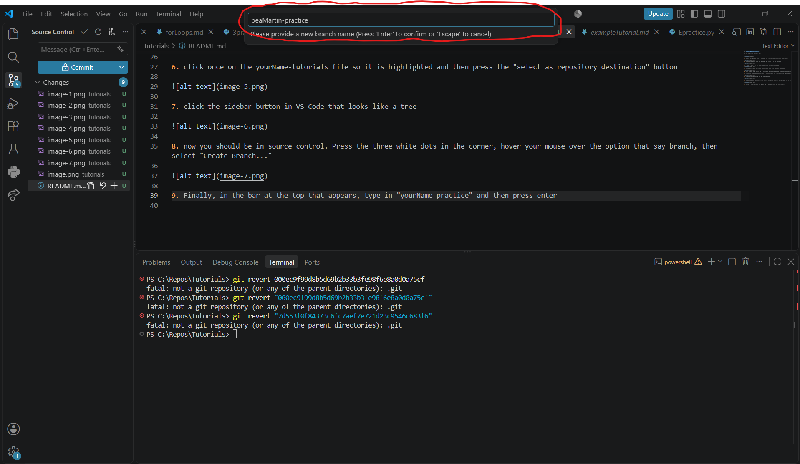

**`WELCOME TO MINUTEBOTS TUTORIALS!`**

If this is your first time, start here:

1. Click the green button that says code and then copy the link that says HTTPS

1. Go to VS Code. Open a new window in VS Code and then press the blue button that says "clone repository"

1. Paste the link that you copied into the top bar that will pop up and then press enter

1. A window to select a file will pop up. Double click on the tab that says Windows C:

1. In Windows C:, create a new folder by pressing the new folder button and name it yourNameRepos (no spaces, no punctuation).

1. Double click the folder you just made to go inside it. After that create another folder within that one called yourNameTutorials.
1. Click once on the yourName-tutorials file so it is highlighted and then press the "select as repository destination" button

1. click the sidebar button in VS Code that looks like a tree

1. now you should be in source control. Press the three white dots in the corner, hover your mouse over the option that says branch, then select "Create Branch..."

1. Finally, in the bar at the top that appears, type in "yourName-practice" and then press enter

Now you are all done cloning our repository and setting up a branch for your to practice in! Continue on now by opening up the "make a variable" tutorial in VS Code within your branch and following the intructions!

